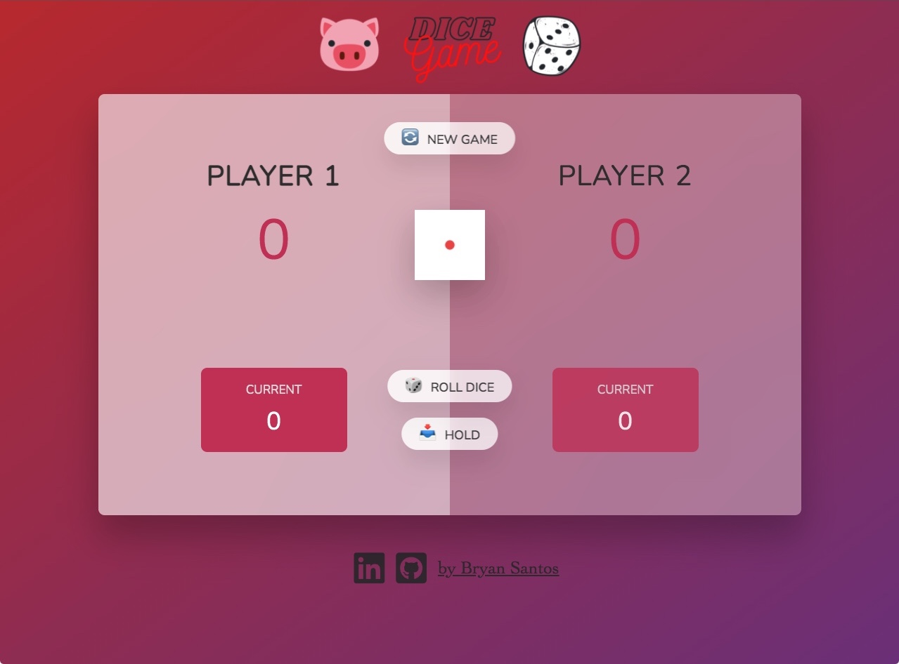
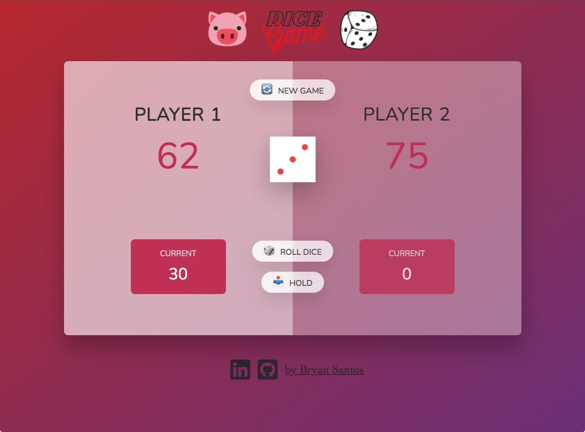
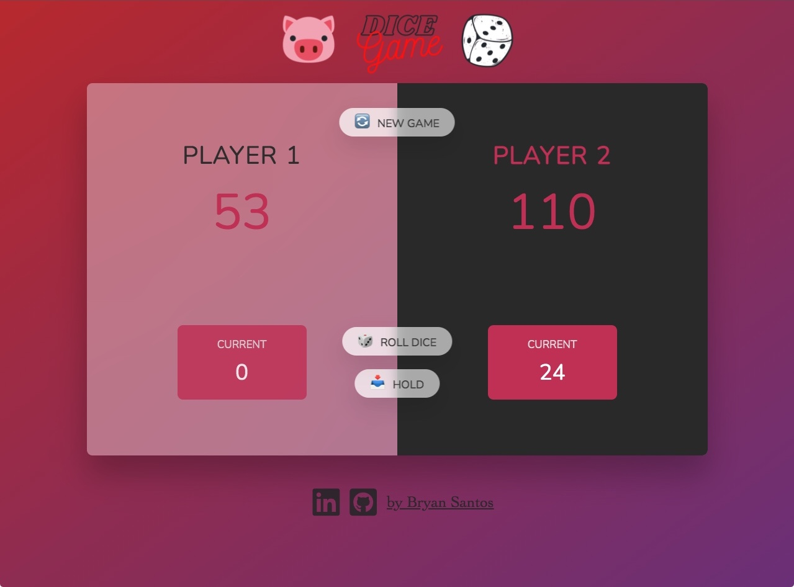

# Pig Dice Game

**Pig** is a simple dice game where players take turns to roll a single die as many times as they wish, adding all roll results to a running total, but losing their gained score for the turn if they roll a 1. This game was built as a playful exercise using a combination of **HTML**/**CSS**/**JS**.

[Give it a try!](https://bryandevelops.github.io/Pig-Dice-Game/)

## Rules

- Beginning with Player 1, click `ROLL DICE` to generate a number between 1 and 6 in the hopes of building up a score.
- Players can click `HOLD` to add the score they accumulated on their turn to their total.
- Anytime a 1 is rolled by a player their turn ends, their built up score during the turn is lost, and it becomes the next players turn.
- The player who reaches a total score of at least 100 using probability and luck will be the winner.
- To play again, click the `NEW GAME` button at the top to reset the game and all totals.

## Demo

Here is a quick demonstration of the game in action.

## Images

1. ###### New Game

   

2. ###### Mid Game

   

3. ###### Player 2 Win
   

## Enjoy!

[Give it a try!](https://bryandevelops.github.io/Pig-Dice-Game/)
